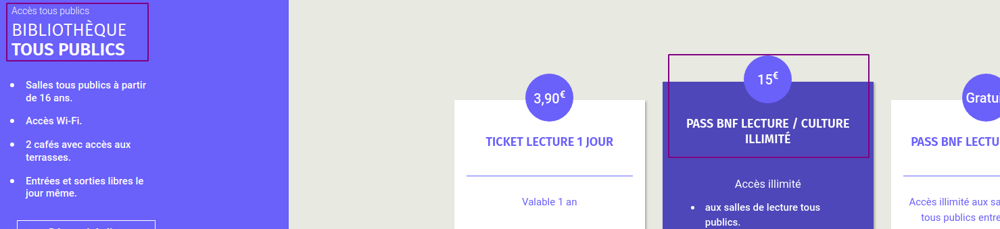
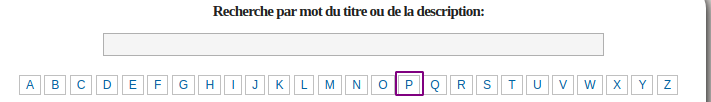
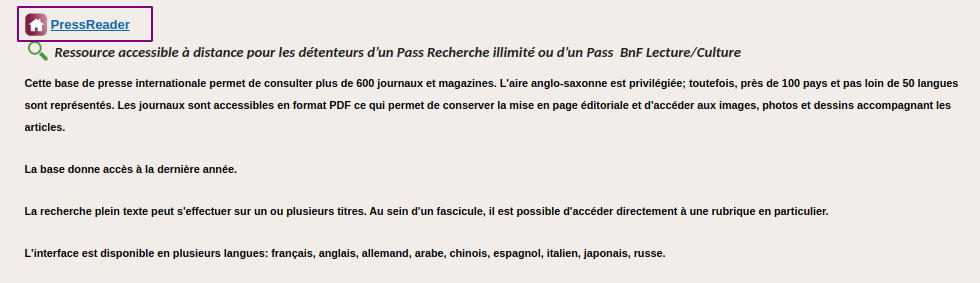

# La presse Française pour 15€/an

Un tuyau pour tous : avoir accès à toute la presse française dans un kiosque numérique pour 15€/an,  100% légal...
 C'est la BNF qui s'est abonnée pour vous, donc le service public, avec vos sous.
C'est pas "tout pourri", le service public, par contre c'est toujours un parcours du combattant...
Oui parce qu'il faut le mériter... sinon tout le monde pourrait en profiter, même les pauvres ...
Bref, un petit mode d'emploi :

1. téléchargez (https://about.pressreader.com/download-app/) ... ça commence bien hein ? Vive le service public...
2. Créez un compte sur pressreader . Viva el sevice de la  republica ! Le plus simple, c'est avec l'appli. Il semble que ça marche aussi avec un navigateur web (firefox...).
3. Créez un compte sur la BNF (https://inscriptionbilletterie.bnf.fr) en choisissant le passe (avec un e, en français, ne déplaise) "BNF Illimité LECTURE CULTURE" !

    

4. Attendez la validation par la BNF ( réception d'un mail -- comptez plusieurs jours -- faut bien occuper les agents de la BNF...)

5. Ensuite, rendez-vous ici : https://www.bnf.fr/fr/les-ressources-accessibles-distance#bnf-comment-faire-pour-acc-der-distance-

6. Dans la liste alphabétique, cliquez sur P, pour aller directement à Pressreader ...

    
  et ensuite sur le lien de PressReader
    

7. Connectez vous avec vos identifiants  BnF (deuxième image).
  J'en suis à cette étape, donc plus de copie d'écran à montrer après celle-ci.

8. Puis avec vos identifiants PressReader ... et vous aurez accès au kiosque.
  Voilà. J'avais prévenu, c'est pas "super simple"...

Bon pour ceux qui trouvent ça chouette mais trop compliqué (#cépafo) :  vous pouvz aussi créer un compte perso sur PressReader... c'est 30€... par mois ....  Ou bien profiter du service public...

PS : [vu en premier ici](https://twitter.com/Silvae/status/1482037482858463236)

